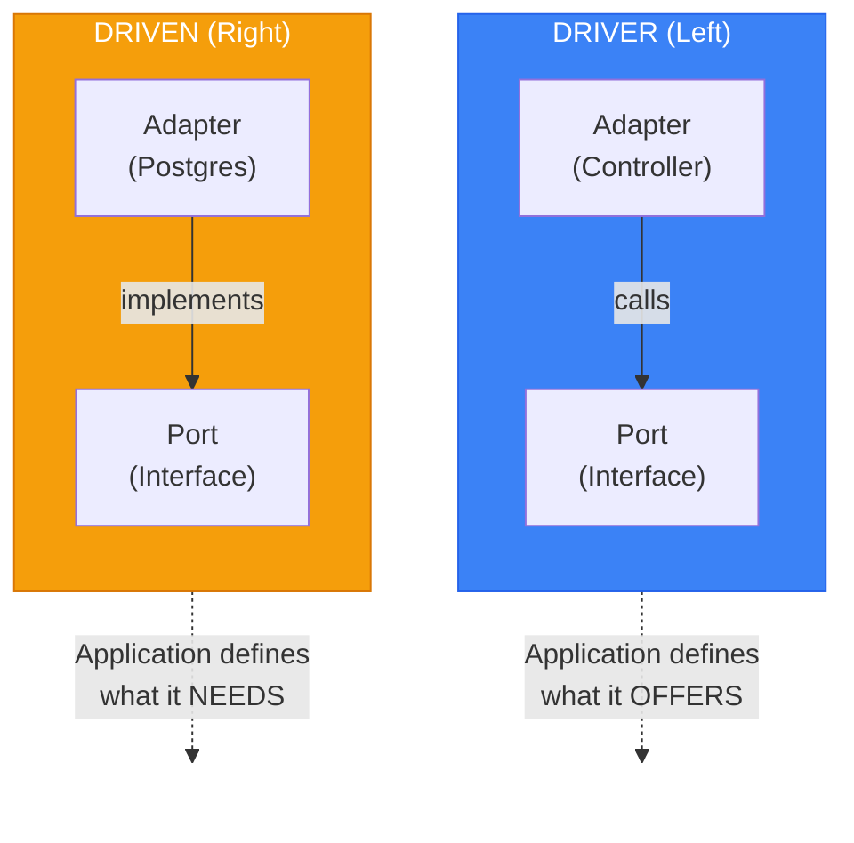

## When to use this skill
- Designing new APIs, microservices, or backend systems
- Refactoring legacy codebases to improve modularity and testability

## When NOT to use this skill
- Generic steps you already know
- Obvious tool usage
- Restating what the skill is for

> Sources:
> Primary:
> - [Hexagonal Architecture](https://alistair.cockburn.us/hexagonal-architecture/) — Alistair Cockburn (2005)
> - [Hexagonal Architecture Explained](https://openlibrary.org/works/OL38388131W) — Alistair Cockburn & Juan Manuel Garrido de Paz (2024)
> - [Interview with Alistair Cockburn](https://jmgarridopaz.github.io/content/interviewalistair.html) — Juan Manuel Garrido de Paz
> Implementation guide:
> - [Hexagonal Architecture Pattern](https://docs.aws.amazon.com/prescriptive-guidance/latest/cloud-design-patterns/hexagonal-architecture.html) — AWS

## Core Concept

> "Allow an application to equally be outbound by users, programs, automated tests, or batch scripts, and to be developed and tested in isolation from its eventual run-time devices and databases."
> — Alistair Cockburn

**Design validation technique:** The pattern was designed with FIT testing in mind—business experts can write test cases before any GUI exists. If you can run your entire application from test fixtures, your hexagonal boundaries are correct.

**Violations to catch:**
- Domain importing database/HTTP libraries
- In this architecture style, controllers calling repositories directly instead of application use cases
- Entities depending on application services

**The hexagon is conceptual.** Most applications have 2-4 ports, not six. The shape emphasizes that all external interactions go through ports, regardless of direction.

This file uses a Hexagonal-focused layout where outbound ports live under `application/ports/outbound/`. In a DDD-centered layout, aggregate repository interfaces often live beside the aggregate in `domain/`. The important rule is ownership: the application/domain defines the abstractions it needs, and technology adapters implement them from the outside.

---

## Quick Decision Trees

### "Where does this code go?"

```
Where does it go?
├─ Pure business logic, no I/O           → domain/
├─ Orchestrates domain + has side effects → application/
├─ Talks to external systems              → infrastructure/
├─ Defines HOW to interact (interface)    → port (domain or application)
└─ Implements a port                      → adapter (infrastructure)
```

### "Is this an Entity or Value Object?"

```
Entity or Value Object?
├─ Has unique identity that persists → Entity
├─ Defined only by its attributes    → Value Object
├─ "Is this THE same thing?"         → Entity (identity comparison)
└─ "Does this have the same value?"  → Value Object (structural equality)
```

## Ports

Interfaces defining how the application communicates with the outside world.

Explicit port interfaces are useful when multiple adapters, testing seams, or team boundaries justify them. For small codebases, a public use-case handler method can be enough as the input port.

## Port Naming Conventions

Repository port placement varies by school: DDD-centered code often keeps aggregate repositories in `domain/{aggregate}/repository`; stricter Hexagonal layouts often group them under `application/ports/outbound/`. Pick one convention per codebase.

| Type | Pattern | Examples |
|------|---------|----------|
| Inbound Port | `I{Action}UseCase` | `IPlaceOrderUseCase`, `IGetOrderUseCase` |
| Outbound Port | `I{Resource}Repository` | `IOrderRepository`, `IProductRepository`|

---

### Inbound Ports (Primary / Inbound)

Define **how the world uses your application**.

- Entry points to the application
- Called by adapters
- Represent use cases

```typescript
// application/ports/input/place_order_port.ts
export interface IPlaceOrderPort {
  execute(command: PlaceOrderCommand): Promise<OrderId>;
}

// application/ports/input/get_order_port.ts
export interface IGetOrderPort {
  execute(query: GetOrderQuery): Promise<OrderDTO | null>;
}

// application/ports/input/cancel_order_port.ts
export interface ICancelOrderPort {
  execute(command: CancelOrderCommand): Promise<void>;
}
```

### Outbound Ports (Secondary / Outbound)

Define **how your application uses external systems**.

- Dependencies the application needs
- Implemented by adapters
- Application calls these interfaces

```typescript
// application/ports/outbound/order_repository_port.ts
export interface IOrderRepositoryPort {
  findById(id: OrderId): Promise<Order | null>;
  save(order: Order): Promise<void>;
  delete(order: Order): Promise<void>;
}

// application/ports/outbound/event_publisher_port.ts
export interface IEventPublisherPort {
  publish(event: DomainEvent): Promise<void>;
  publishAll(events: DomainEvent[]): Promise<void>;
}

// application/ports/outbound/payment_gateway_port.ts
export interface IPaymentGatewayPort {
  charge(amount: Money, paymentMethod: PaymentMethod): Promise<PaymentResult>;
  refund(paymentId: PaymentId, amount: Money): Promise<RefundResult>;
}

// application/ports/outbound/notification_port.ts
export interface INotificationPort {
  sendEmail(to: Email, template: EmailTemplate): Promise<void>;
  sendSMS(to: PhoneNumber, message: string): Promise<void>;
}
```

---

## Adapters

Concrete implementations that connect ports to external technologies.

### Inbound Adapters (Primary / Inbound)

Convert external inputs to port calls.

```typescript
// infrastructure/adapters/input/rest/order_controller.ts
import { Router, Request, Response } from 'express';
import { IPlaceOrderPort } from '@/application/ports/input/place_order_port';
import { IGetOrderPort } from '@/application/ports/input/get_order_port';

export class OrderController {
  constructor(
    private readonly placeOrder: IPlaceOrderPort,
    private readonly getOrder: IGetOrderPort,
  ) {}

  async create(req: Request, res: Response): Promise<void> {
    const command: PlaceOrderCommand = {
      customerId: req.user.id,
      items: req.body.items.map((item: any) => ({
        productId: item.product_id,
        quantity: item.quantity,
      })),
    };

    const orderId = await this.placeOrder.execute(command);
    res.status(201).json({ id: orderId.value });
  }

  async show(req: Request, res: Response): Promise<void> {
    const order = await this.getOrder.execute({ orderId: req.params.id });

    if (!order) {
      res.status(404).json({ error: 'Order not found' });
      return;
    }

    res.json(order);
  }
}

// infrastructure/adapters/input/grpc/order_service.ts
import { IPlaceOrderPort } from '@/application/ports/input/place_order_port';
import { OrderServiceServer, PlaceOrderRequest, PlaceOrderResponse } from './generated/order_pb';

export class GrpcOrderService implements OrderServiceServer {
  constructor(private readonly placeOrder: IPlaceOrderPort) {}

  async placeOrder(
    request: PlaceOrderRequest,
  ): Promise<PlaceOrderResponse> {
    const command: PlaceOrderCommand = {
      customerId: request.getCustomerId(),
      items: request.getItemsList().map(item => ({
        productId: item.getProductId(),
        quantity: item.getQuantity(),
      })),
    };

    const orderId = await this.placeOrder.execute(command);

    const response = new PlaceOrderResponse();
    response.setOrderId(orderId.value);
    return response;
  }
}

// infrastructure/adapters/input/cli/place_order_command.ts
import { Command } from 'commander';
import { IPlaceOrderPort } from '@/application/ports/input/place_order_port';

export function createPlaceOrderCommand(placeOrder: IPlaceOrderPort): Command {
  return new Command('place-order')
    .description('Place a new order')
    .requiredOption('-c, --customer <id>', 'Customer ID')
    .requiredOption('-p, --product <id>', 'Product ID')
    .requiredOption('-q, --quantity <number>', 'Quantity', parseInt)
    .action(async (options) => {
      const orderId = await placeOrder.execute({
        customerId: options.customer,
        items: [{ productId: options.product, quantity: options.quantity }],
      });

      console.log(`Order created: ${orderId.value}`);
    });
}

// infrastructure/adapters/input/message/order_message_handler.ts
import { IPlaceOrderPort } from '@/application/ports/input/place_order_port';

export class OrderMessageHandler {
  constructor(private readonly placeOrder: IPlaceOrderPort) {}

  async handlePlaceOrderMessage(message: PlaceOrderMessage): Promise<void> {
    await this.placeOrder.execute({
      customerId: message.customerId,
      items: message.items,
    });
  }
}
```

### Outbound Adapters (Secondary / Outbound)

Implement port interfaces using specific technologies.

```
class PostgresOrderRepository implements IOrderRepositoryPort:
    db: Database

    findById(id: OrderId) -> Order | null:
        row = db.orders.where(id: id.value).first()
        if not row:
            return null
        return OrderMapper.toDomain(row)

    save(order: Order):
        data = OrderMapper.toPersistence(order)
        db.orders.upsert(data)

    delete(order: Order):
        db.orders.where(id: order.id.value).delete()
```

**In-Memory (for tests):**

```
class InMemoryOrderRepository implements IOrderRepositoryPort:
    orders: Map<string, Order> = {}

    findById(id: OrderId) -> Order | null:
        return orders.get(id.value) or null

    save(order: Order):
        orders.set(order.id.value, order)

    delete(order: Order):
        orders.delete(order.id.value)

    clear():
        orders.clear()
```

**Payment Gateway:**

```
class StripePaymentGateway implements IPaymentGatewayPort:
    stripe: StripeClient

    charge(amount: Money, paymentMethod: PaymentMethod) -> PaymentResult:
        try:
            intent = stripe.paymentIntents.create({
                amount: amount.cents,
                currency: amount.currency,
                paymentMethod: paymentMethod.stripeId,
                confirm: true
            })
            return PaymentResult.success(PaymentId.from(intent.id))
        catch CardError as error:
            return PaymentResult.failed(error.message)

    refund(paymentId: PaymentId, amount: Money) -> RefundResult:
        refund = stripe.refunds.create({paymentIntent: paymentId.value, amount: amount.cents})
        return RefundResult.success(RefundId.from(refund.id))
```

**Event Publisher:**

```
class RabbitMQEventPublisher implements IEventPublisherPort:
    channel: Channel

    publish(event: DomainEvent):
        channel.publish("domain_events", event.eventType, serialize({
            eventId: event.eventId,
            eventType: event.eventType,
            occurredAt: event.occurredAt,
            payload: event.toPayload()
        }))

    publishAll(events: List<DomainEvent>):
        for event in events:
            publish(event)
```

---

## Dependency Rules Matrix

|  | Domain | Application | Infrastructure |
|--|--------|-------------|----------------|
| **Domain** | ✅ | ❌ | ❌ |
| **Application** | ✅ | ✅ | ❌ |
| **Infrastructure** | ✅ | ✅ | ✅ |

✅ = Can depend on
❌ = Cannot depend on

## Naming Conventions

### Alistair Cockburn's Recommended Pattern

**Ports:** `For[Doing][Something]`
- Inbound: `ForPlacingOrders`, `ForConfiguringSettings`
- Outbound: `ForStoringUsers`, `ForNotifyingAlerts`

**Adapters:** Reference the technology
- `CliCommandForPlacingOrders`
- `MysqlDatabaseForStoringUsers`
- `SlackNotifierForAlerts`

### Alternative Patterns

| Pattern | Port | Adapter |
|---------|------|---------|
| Interface/Impl | `IOrderRepository` | `PostgresOrderRepository` |
| Port suffix | `OrderRepositoryPort` | `PostgresOrderAdapter` |
| Using prefix | `IOrderStorage` | `OrderStorageUsingPostgres` |

### Project Structure

```
src/
├── domain/
│   ├── jobs/
│   │   └── job.entity.ts
│   ├── profile/
│   │   └── profile.entity.ts
│   └── sources/
│       └── raw-job.entity.ts
├── application/
│   ├── usecases/
│   │   ├── jobs/
│   │   │   ├── score-unscored-jobs.usecase.ts
│   │   │   └── normalize-and-persist-jobs.usecase.ts
│   │   └── profile/
│   │       ├── upsert-profile.usecase.ts
│   │       └── get-profile.usecase.ts
│   └── ports/
│       ├── input/
│       │   ├── jobs.usecase.port.ts
│       │   └── profile.usecase.port.ts
│       └── output/
│           ├── jobs-repository.port.ts
│           ├── scoring-provider.port.ts
│           └── profile-repository.port.ts
├── infrastructure/
│   ├── adapters/
│   │   ├── input/
│   │   │   └── rest/
│   │   │       ├── jobs.controller.ts
│   │   │       └── profile.controller.ts
│   │   └── output/
│   │       ├── repositories/
│   │       │   ├── prisma-jobs.repository.ts
│   │       │   ├── prisma-profile.repository.ts
│   │       │   └── prisma-fetch-runs.repository.ts
│   │       └── connectors/
│   │           ├── france-travail/
│   │           └── wttj-rss/
│   └── db/
│       └── prisma-client.ts
└── types/
    └── supertest.d.ts
```

---

## Key Asymmetry



---

## Configurability via Adapters

The power of hexagonal architecture: swap adapters without changing the core.

```typescript
// infrastructure/config/container.ts

function configureDevelopment(container: Container): void {
  container.bind<IOrderRepositoryPort>('IOrderRepositoryPort')
    .to(InMemoryOrderRepository);
  container.bind<IEventPublisherPort>('IEventPublisherPort')
    .to(InMemoryEventPublisher);
  container.bind<IPaymentGatewayPort>('IPaymentGatewayPort')
    .to(FakePaymentGateway);
}

function configureTest(container: Container): void {
  container.bind<IOrderRepositoryPort>('IOrderRepositoryPort')
    .to(InMemoryOrderRepository);
  container.bind<IEventPublisherPort>('IEventPublisherPort')
    .to(SpyEventPublisher);
  container.bind<IPaymentGatewayPort>('IPaymentGatewayPort')
    .to(MockPaymentGateway);
}

function configureProduction(container: Container): void {
  container.bind<IOrderRepositoryPort>('IOrderRepositoryPort')
    .to(PostgresOrderRepository);
  container.bind<IEventPublisherPort>('IEventPublisherPort')
    .to(RabbitMQEventPublisher);
  container.bind<IPaymentGatewayPort>('IPaymentGatewayPort')
    .to(StripePaymentGateway);
}

function configureWithMongoDB(container: Container): void {
  container.bind<IOrderRepositoryPort>('IOrderRepositoryPort')
    .to(MongoDBOrderRepository);
}
```

---

## Strong vs Weak Hexagonal

### Weak Implementation

Port is technology-aware (not truly abstract):

```typescript
// ❌ Weak: Leaks SQL concepts
interface IOrderRepository {
  findByQuery(sql: string, params: any[]): Promise<Order[]>;
}
```

### Strong Implementation

Port is fully technology-agnostic:

```typescript
// ✅ Strong: Pure domain concepts
interface IOrderRepository {
  findById(id: OrderId): Promise<Order | null>;
  findByCustomer(customerId: CustomerId): Promise<Order[]>;
  save(order: Order): Promise<void>;
}
```

---

## Resources

### Books & Primary Articles
- Clean Architecture (Robert C. Martin, 2017)
- Hexagonal Architecture Explained (Alistair Cockburn, 2024)
- Get Your Hands Dirty on Clean Architecture (Tom Hombergs, 2019)


### Reference Implementations

- TypeScript: [jbuget/nodejs-clean-architecture-app](https://github.com/jbuget/nodejs-clean-architecture-app)


### Official Documentation
- https://blog.cleancoder.com/uncle-bob/2012/08/13/the-clean-architecture.html
- https://alistair.cockburn.us/hexagonal-architecture/
